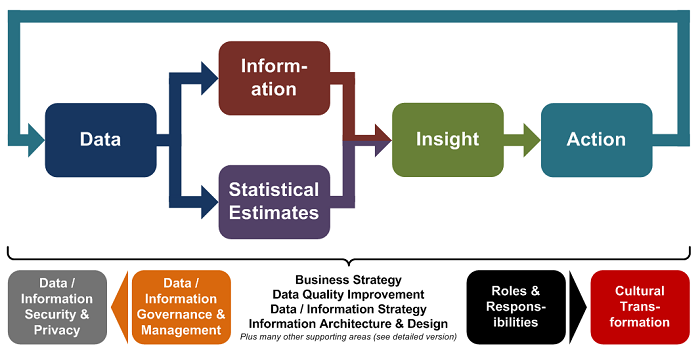
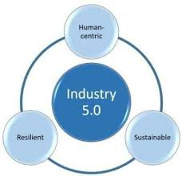

# Lecture 01 — Informatics, Industry 5.0, and the Rise of AI Engineering

**Course:** AI-Enabled Informatics for Engineers  
**Week:** 1  
**Primary Text:** Chip Huyen, *AI Engineering* (2024/2025), Chapter 1  
**Format:** GitHub-first · notebook-adjacent · discussion-driven  

This lecture introduces the **core intellectual framing of the course**:  
how information flows through engineered systems — and how modern AI, especially **foundation models**, changes how we design, evaluate, and operate those systems.

This is **not** a traditional machine learning course, data science survey, or programming bootcamp.  
It is a course about **systems, decisions, and engineering discipline** in the age of AI.

By the end of the semester, you will build a **working AI-enabled informatics system** that improves a **real decision workflow**, using principles applied by industry teams today.

---

## Quick Links (Start Here)

- ▶️ **Run the Week 1 notebook**  
  [`01_informatics_setup_and_decision_framing.ipynb`](../notebooks/week01/01_informatics_setup_and_decision_framing.ipynb)

- 📘 **Chip Huyen — Chapter 1 summary (public)**  
  https://github.com/chiphuyen/aie-book/blob/main/chapter-summaries.md#chapter-1-introduction-to-building-ai-applications-with-foundation-models

- 🧠 **Informatics framing**
  - NCBI: https://www.ncbi.nlm.nih.gov/books/NBK470564/  
  - Edinburgh: https://informatics.ed.ac.uk/about/what-is-informatics  

- 🏭 **Industry 5.0 overview (EU)**  
  https://research-and-innovation.ec.europa.eu/research-area/industrial-research-and-innovation/industry-50_en

---

## Today’s Roadmap

In this lecture, we will:

1. Define **informatics** using authoritative sources  
2. Introduce **Industry 5.0** (human-centric, sustainable, resilient systems)  
3. Explain **why AI engineering emerged** (Chip Huyen, Ch. 1)  
4. Walk through a simple **data → decision** example  
5. Review **Week 1 deliverables**

---

## Informatics: The Core Idea

At its core, **informatics is the engineering of:**

> **data → information → decisions → actions**

- **Data** is raw  
- **Information** is structured and contextualized  
- **Decisions** are actionable choices  
- **Actions** create real-world outcomes  

Informatics is not about “building a model.”  
It is about designing the **entire system** that supports a decision — including pipelines, schemas, evaluation logic, and human interfaces.

> Throughout this course, you are building **informatics systems**, not isolated AI components.

Data→Info→Decision→Action pipeline (https://peterjamesthomas.com/2015/12/24/data-management-as-part-of-the-data-to-action-journey)

---

## Informatics: Authoritative Definitions

### NCBI (Biomedical Informatics)

NCBI defines informatics as the discipline concerned with:

> acquisition, storage, retrieval, processing, and **decision support**

Key insight:
- Informatics is **end-to-end**
- Analytics and modeling are only parts of a larger system

📘 https://www.ncbi.nlm.nih.gov/books/NBK470564/

---

### University of Edinburgh (Informatics)

Edinburgh emphasizes:

> representation, transformation, and communication of information  
> across natural and artificial systems

Why this matters for AI:
- Modern AI systems — especially foundation models — are **representation transformers**
- Prompting, retrieval, embeddings, and evaluation are fundamentally representation design problems

📘 https://informatics.ed.ac.uk/about/what-is-informatics

---

## Why Informatics Matters in 2026

Modern engineering domains are **information-dense**:
- cybersecurity  
- healthcare  
- energy  
- manufacturing  
- transportation  

AI dramatically increases capability — but also introduces **new failure modes**:
- hallucinations  
- model drift  
- cost spikes  
- opaque reasoning  

Informatics provides the discipline to design systems that are:

- reliable  
- interpretable  
- auditable  
- aligned with human goals and real-world constraints  

---

## Industry 5.0 Overview (Framing)

Industry 5.0 is the European Commission’s framing for the next industrial era.  
It emphasizes three pillars:

1. **Human-centric systems**  
2. **Sustainability**  
3. **Resilience**

Human-centric:
- AI augments humans, not replaces them  

Sustainability:
- Energy, cost, and environmental impact matter  

Resilience:
- Systems must withstand failure, attack, and uncertainty  

📘 https://research-and-innovation.ec.europa.eu/research-area/industrial-research-and-innovation/industry-50_en

Industry 5.0 Pillars (https://www.researchgate.net/figure/Figure-2-Three-Pillars-of-Industry-50_fig2_370059249)

---

## Industry 5.0 → AI Engineering Implications

Industry 5.0 directly shapes how we design AI systems:

**Human-centric**
- Human-in-the-loop approvals
- Interpretability and auditability

**Resilience**
- Monitoring and fallback modes
- Graceful degradation when models are uncertain

**Sustainability**
- Latency, inference cost, and energy as engineering constraints

These principles will guide **every project decision** you make this semester.

---

## Discussion Prompt (Canvas)

**Pick one Industry 5.0 value** and answer:

> What concrete AI system design choice does this value change?

Examples:
- human-centric → add a human approval checkpoint  
- resilience → add monitoring + fallback logic  
- sustainability → reduce model calls using caching or retrieval  

This is your **first real design decision**.

---

## Chip Huyen — The Rise of AI Engineering

Chip Huyen’s Chapter 1 introduces **AI engineering** as a discipline distinct from ML engineering.

Key shift:
- The primary challenge is **no longer training models**
- It is building **applications around foundation models**

AI engineering focuses on:
- retrieval  
- prompting  
- evaluation  
- architecture  
- monitoring  
- human feedback loops  

📘 Public summary:  
https://github.com/chiphuyen/aie-book/blob/main/chapter-summaries.md#chapter-1-introduction-to-building-ai-applications-with-foundation-models

*(Suggested figure: AI engineering components)*  
`assets/aie_ch1_components.png`

---

## What Changed with Foundation Models

Foundation models introduced:

- **Self-supervision at scale**
- **Multimodality**
- **Model-as-a-service APIs**

But also new risks:
- hallucinations  
- drift  
- cost unpredictability  

This is why **evaluation and monitoring** are central themes in this course.

---

## AI Engineering vs ML Engineering (Simplified)

- **ML engineering**: training models  
- **AI engineering**: integrating models into systems  

In AI engineering, the model is just **one layer** among:
- data  
- retrieval  
- guardrails  
- evaluation  
- monitoring  
- user interface  
- feedback loops  

---

## Mini Demo: Data → Decision

This week’s notebook walks through a minimal informatics example:

1. Load a dataset  
2. Aggregate values  
3. Interpret results  
4. Translate into a decision  

▶️ Run:  
`01_informatics_setup_and_decision_framing.ipynb`

---

## Week 1 Deliverables (Canvas)

You have **two deliverables** this week:

1. **Cloud access check**  
   - Google Colab (recommended), Azure for Students, or AWS Educate

2. **Project domain shortlist**
   - 3 domains
   - 1 decision per domain

Choose something that is:
- meaningful  
- feasible  
- decision-driven  

---

## Looking Ahead

Next week:
- Foundation models
- SQL for decision framing

You will submit **Project Milestone M1 (graded)**:
- domain  
- decision  
- dataset plan  
- success criteria  

This milestone sets the direction for your entire project.

---

## Contact & Support

**TA Sessions**
- Twice weekly
- Your best resource — use them

**TA**
- Keyi Wang  
- kw653@scarletmail.rutgers.edu  

Office hours by request (email).
