# Week 4 — Evaluation Methodology
### AI-Enabled Informatics for Engineers | Spring 2026
**Rutgers ISE | Instructor: Dr. Ron Iammartino**

> **📖 Primary Text:** Chip Huyen, *AI Engineering: Building Applications with Foundation Models*, Chapter 3  
> **🛡️ Framework:** NIST AI Risk Management Framework (AI RMF)  
> **⏱️ Estimated Lecture Time:** ~60 minutes  
> **🔗 Colab Demos:** 3 interactive notebooks embedded below

---

## 🗺️ Lecture Roadmap

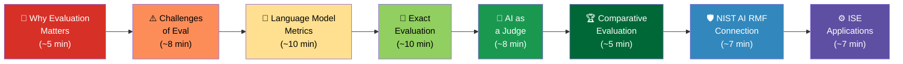

---

## Part 1 — Why Evaluation Matters (and Why We Get It Wrong) 🚨
**⏱️ ~5 minutes**

### The Stakes Are Real

Chip Huyen opens Chapter 3 with a sober warning: **the more AI is used, the more opportunity there is for catastrophic failure.** These aren't hypotheticals — they've already happened:

| Real Incident | What Went Wrong | Consequence |
|---|---|---|
| Chatbot companion app (2023) | Chatbot encouraged self-harm | User death |
| Lawyers using ChatGPT (2023) | AI hallucinated case citations | Sanctions, sanctions, sanctions |
| Air Canada chatbot (2024) | Bot gave false refund policy | Court-ordered damages |

> **💡 Key Insight for ISE Students:** In industrial systems, a sensor that is 99% accurate sounds great — until that 1% error causes a $10M equipment failure or a safety incident. **Evaluation isn't optional. It's engineering.**

### The "Vibe Check" Problem

A 2023 a16z study found that 6 out of 70 AI decision-makers at major companies evaluated their AI systems by **word of mouth** — someone told them it was good. Many others admitted to "eyeballing results" or running the same 5 prompts over and over.

This is the equivalent of testing your structural bridge design by asking a friend, "Does it look sturdy to you?"

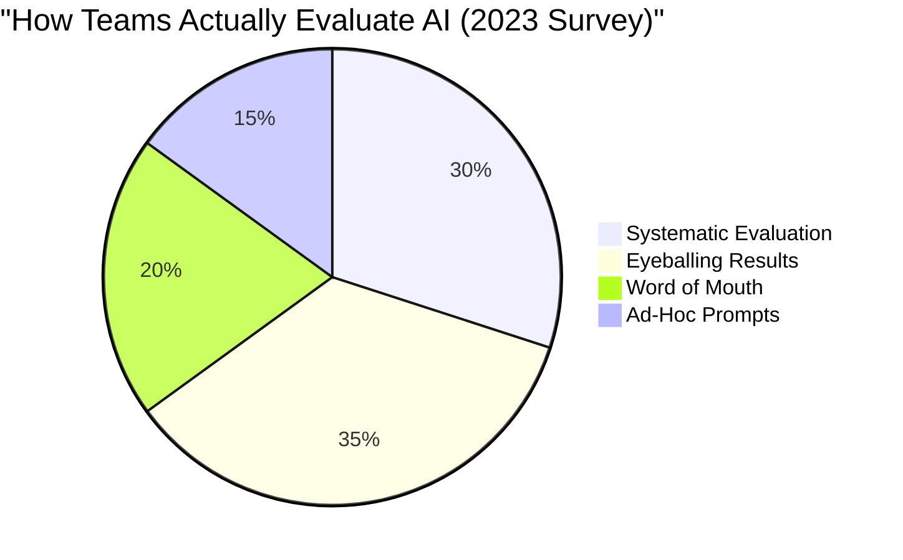

**The goal of Week 4:** Give you a systematic toolset so you never have to say "I eyeballed it."

---

## Part 2 — Four Reasons Foundation Models Are Hard to Evaluate ⚠️
**⏱️ ~8 minutes**

Traditional ML evaluation was hard. Foundation model evaluation is **harder**. Here's why:

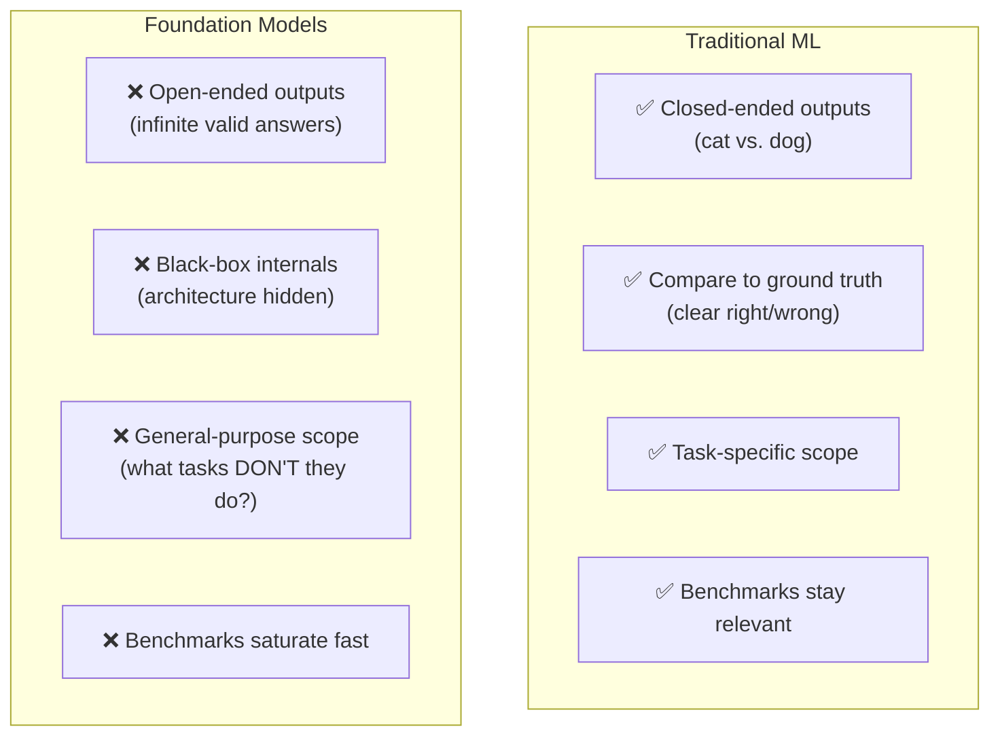

### Reason 1: Intelligence Makes Grading Harder

> *"Most people can tell if a first grader's math solution is wrong. Few can do the same for a PhD-level math solution."* — Huyen, Ch. 3

As AI gets smarter, fewer humans can reliably grade its outputs. By 2024, Fields medalist Terrence Tao was one of the few qualified to evaluate GPT-o1's math reasoning.

### Reason 2: Open-Ended Outputs Break Ground-Truth Comparison

For "What's 2+2?" there's one answer. For "Summarize this engineering report in a way that helps a plant manager decide whether to perform maintenance today" — there are thousands of valid responses.

You can't pre-enumerate all correct outputs. **Ground-truth evaluation doesn't scale to open-ended tasks.**

### Reason 3: Black-Box Models

Most enterprise-grade foundation models don't reveal:
- Training data composition
- Model architecture details
- Fine-tuning procedures

Without knowing what the model was trained on, you can't predict where it will fail. You can only observe outputs.

### Reason 4: Benchmark Saturation — The Arms Race

| Benchmark | Year Released | Year Saturated | Successor |
|---|---|---|---|
| GLUE | 2018 | 2019 | SuperGLUE |
| NaturalInstructions | 2021 | 2022 | Super-NaturalInstructions |
| MMLU | 2020 | ~2023 | MMLU-Pro (2024) |

Models keep getting better faster than we can create new tests. This is a core challenge for governance — a point NIST AI RMF takes seriously (more in Part 6).

---

## Part 3 — Language Modeling Metrics: Entropy, Cross-Entropy & Perplexity 📐
**⏱️ ~10 minutes + Demo 1**

> 💡 **Why does this matter to you?** Even if you're not training LLMs, these metrics appear on model cards, in API documentation, and in performance comparisons. You'll see "perplexity: 3.2" — you need to know what that means.

### Entropy — How Unpredictable Is the Data?

**Entropy** measures how much information a token carries on average. Higher entropy = more unpredictable = harder to model.

Think about it like this: If I tell you to predict the next word in a children's book sentence vs. a legal contract, which is harder? The legal contract has higher entropy — more possible next words, more information per word.

```
Low Entropy (Predictable)           High Entropy (Unpredictable)
─────────────────────────────       ─────────────────────────────
HTML: <head>...</head>              "Whereas the party of the..."
Highly structured code              Novel legal arguments
Simple children's vocabulary        Technical medical literature
Binary sensor states (on/off)       Freeform user feedback text
```

**Formula:**
$$H(P) = -\sum_{x} P(x) \log_2 P(x)$$

Where P(x) is the probability of token x occurring. The **more uniform** the distribution, the higher the entropy.

### Cross-Entropy — How Well Does the Model Match Reality?

When a language model trains on data with true distribution **P**, it learns an approximation **Q**. Cross-entropy measures the gap:

$$H(P, Q) = H(P) + D_{KL}(P \| Q)$$

- **H(P)** = inherent difficulty of the data (you can't improve this)
- **D_KL(P‖Q)** = how far the model's distribution Q is from truth P (this shrinks with better training)

**A perfectly trained model would have:** H(P,Q) = H(P) — zero gap between the model and reality.

### Perplexity — The Practical Metric

Perplexity is simply the **exponentiated cross-entropy** — it converts bits to a more intuitive number:

$$\text{PPL} = 2^{H(P,Q)}$$

**Intuition:** Perplexity ≈ the number of equally-likely options the model thinks it has for each next token.

```
Perplexity = 4   →   Model is deciding between ~4 equally likely next tokens
Perplexity = 100 →   Model is confused, like picking from 100 options
Perplexity = 3   →   Model is highly confident — extraordinary performance
```

### Rules for Interpreting Perplexity

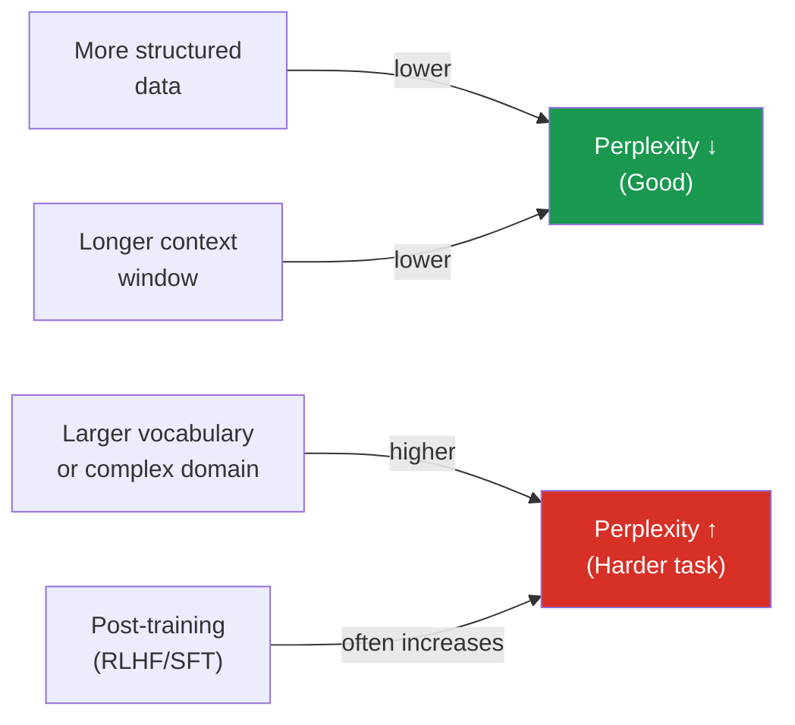

### Perplexity Beyond Training: 3 Practical Uses

1. **Data Contamination Detection** — A model has unusually LOW perplexity on a benchmark → that benchmark was likely in its training data → results are unreliable
2. **Training Data Deduplication** — Only add new data if perplexity is HIGH → means it's genuinely novel content
3. **Anomaly Detection** — Text like "my dog teaches quantum physics" has extremely HIGH perplexity → flag it as unusual

---

### 🧪 DEMO 1: Perplexity Explorer
**Open in Google Colab:** Explore how perplexity varies across text types

```python
# ============================================================
# DEMO 1: Perplexity Explorer
# Week 4 — AI-Enabled Informatics for Engineers (Rutgers ISE)
#
# Run this in Google Colab. No GPU needed.
# ============================================================

# Step 1: Install dependencies
# !pip install transformers torch --quiet

import torch
import numpy as np
import matplotlib.pyplot as plt
import matplotlib.patches as mpatches
from transformers import GPT2LMHeadModel, GPT2TokenizerFast

print("Loading GPT-2 model (this takes ~30 seconds on first run)...")
model_name = "gpt2"
tokenizer = GPT2TokenizerFast.from_pretrained(model_name)
model = GPT2LMHeadModel.from_pretrained(model_name)
model.eval()
print("✅ Model loaded!")

# ─── Perplexity Calculation Function ───────────────────────────────────────────
def compute_perplexity(text: str, stride: int = 512) -> float:
    """
    Compute perplexity of `text` under GPT-2 using sliding window to
    handle texts longer than the model's context window.
    Returns perplexity as a float.
    """
    encodings = tokenizer(text, return_tensors="pt")
    max_length = model.config.n_positions  # 1024 for GPT-2
    input_ids = encodings.input_ids

    if input_ids.shape[1] == 0:
        return float('inf')

    nlls = []
    prev_end_loc = 0

    for begin_loc in range(0, input_ids.shape[1], stride):
        end_loc = min(begin_loc + max_length, input_ids.shape[1])
        trg_len = end_loc - prev_end_loc
        input_ids_chunk = input_ids[:, begin_loc:end_loc]
        target_ids = input_ids_chunk.clone()
        target_ids[:, :-trg_len] = -100  # mask non-target tokens

        with torch.no_grad():
            outputs = model(input_ids_chunk, labels=target_ids)
            neg_log_likelihood = outputs.loss

        nlls.append(neg_log_likelihood)
        prev_end_loc = end_loc
        if end_loc == input_ids.shape[1]:
            break

    ppl = torch.exp(torch.stack(nlls).mean()).item()
    return round(ppl, 2)

# ─── Test Texts Across 4 Categories ────────────────────────────────────────────
test_cases = {
    # Category 1: Highly Structured (should be LOW perplexity)
    "HTML Code": """<!DOCTYPE html><html><head><title>My Page</title></head>
<body><h1>Hello World</h1><p>This is a paragraph.</p></body></html>""",

    "Python Code": """def calculate_mean(numbers):
    if not numbers:
        return 0
    return sum(numbers) / len(numbers)
result = calculate_mean([1, 2, 3, 4, 5])
print(result)""",

    # Category 2: Natural Language (moderate perplexity)
    "News Article": """The Federal Reserve announced today that interest rates will
remain unchanged following the latest economic data. Officials cited
moderate inflation and steady employment growth as key factors in
their decision to hold rates steady through the current quarter.""",

    "Simple Story": """Once upon a time, a little girl lived in a house near the forest.
Every morning she would wake up early and help her mother make breakfast.
The birds sang outside the window and the sun was bright and warm.""",

    # Category 3: Technical/Domain-Specific (higher perplexity)
    "ISE/Engineering Text": """The reliability function R(t) for a repairable system follows
an NHPP with power-law intensity function lambda(t) = beta/theta*(t/theta)^(beta-1).
MTTR and MTTF calculations require integration over the hazard function
accounting for right-censored field data from the CMMS database.""",

    "Medical Text": """The patient presented with ST-elevation myocardial infarction
confirmed via troponin assay (hs-cTnI > 52 ng/L). PCI was performed
with drug-eluting stent placement in the LAD. Post-procedural TIMI
flow grade 3 was achieved with no residual stenosis on angiography.""",

    # Category 4: Nonsense/Anomalous (HIGH perplexity)
    "Gibberish": """gork plink zim florp naxle quib sternok vrimply dax flurble
wompus snorflax pib gleep quaz mibble tork whindle sax flurbix.""",

    "Semantically Odd": """The purple rectangle ate fourteen dreams before the
mathematics decided to apologize. Clouds invented language after
the ocean forgot how to multiply on alternate Thursdays.""",
}

# ─── Compute All Perplexities ───────────────────────────────────────────────────
print("\n📊 Computing perplexity for each text sample...\n")
results = {}
for label, text in test_cases.items():
    ppl = compute_perplexity(text)
    results[label] = ppl
    print(f"  {label:<30} PPL = {ppl:.1f}")

# ─── Visualization ───────────────────────────────────────────────────────────────
fig, axes = plt.subplots(1, 2, figsize=(16, 6))
fig.suptitle("GPT-2 Perplexity Across Text Types\n(Lower = Model is More Confident)",
             fontsize=14, fontweight='bold')

# --- Left: Bar Chart by Category ---
categories = {
    "Structured Code": ["HTML Code", "Python Code"],
    "Natural Language": ["News Article", "Simple Story"],
    "Technical Domain": ["ISE/Engineering Text", "Medical Text"],
    "Anomalous Text": ["Gibberish", "Semantically Odd"],
}
colors = {"Structured Code": "#1a9850", "Natural Language": "#fee090",
          "Technical Domain": "#fc8d59", "Anomalous Text": "#d73027"}

labels_ordered, ppl_ordered, bar_colors = [], [], []
for cat, items in categories.items():
    for item in items:
        labels_ordered.append(item.replace(" ", "\n"))
        ppl_ordered.append(results[item])
        bar_colors.append(colors[cat])

ax = axes[0]
bars = ax.bar(range(len(labels_ordered)), ppl_ordered, color=bar_colors,
              edgecolor='black', linewidth=0.5)
ax.set_xticks(range(len(labels_ordered)))
ax.set_xticklabels(labels_ordered, fontsize=8, rotation=15, ha='right')
ax.set_ylabel("Perplexity (PPL)", fontsize=11)
ax.set_title("Perplexity by Text Sample", fontsize=12)
ax.set_yscale('log')  # log scale helps see differences
ax.grid(axis='y', alpha=0.4)

# Add value labels on bars
for bar, val in zip(bars, ppl_ordered):
    ax.text(bar.get_x() + bar.get_width()/2, bar.get_height() * 1.05,
            f'{val:.0f}', ha='center', va='bottom', fontsize=8, fontweight='bold')

# Legend
patches = [mpatches.Patch(color=c, label=cat) for cat, c in colors.items()]
ax.legend(handles=patches, loc='upper left', fontsize=8)

# --- Right: Category Average Comparison ---
ax2 = axes[1]
cat_avgs = {cat: np.mean([results[item] for item in items])
            for cat, items in categories.items()}
cat_names = list(cat_avgs.keys())
cat_vals = list(cat_avgs.values())
cat_cols = [colors[c] for c in cat_names]

bars2 = ax2.barh(range(len(cat_names)), cat_vals, color=cat_cols,
                 edgecolor='black', linewidth=0.5)
ax2.set_yticks(range(len(cat_names)))
ax2.set_yticklabels([c.replace(" ", "\n") for c in cat_names], fontsize=10)
ax2.set_xlabel("Average Perplexity (log scale)", fontsize=11)
ax2.set_title("Average Perplexity by Category\n(ISE Insight: Which data type is hardest to model?)",
              fontsize=11)
ax2.set_xscale('log')
ax2.grid(axis='x', alpha=0.4)
ax2.invert_yaxis()  # highest at top

for bar, val in zip(bars2, cat_vals):
    ax2.text(val * 1.02, bar.get_y() + bar.get_height()/2,
             f'{val:.0f}', ha='left', va='center', fontsize=9, fontweight='bold')

# Annotation box
ax2.annotate("ISE Field Data often\nhas DOMAIN-SPECIFIC\nvocabulary → Higher PPL\n→ Harder to model!",
             xy=(cat_avgs["Technical Domain"], 2),
             xytext=(cat_avgs["Technical Domain"] * 2, 0.5),
             arrowprops=dict(arrowstyle='->', color='#d73027'),
             fontsize=9, color='#d73027', fontweight='bold')

plt.tight_layout()
plt.savefig("perplexity_analysis.png", dpi=150, bbox_inches='tight')
plt.show()

print("\n✅ DEMO 1 Complete!")
print("\n🔍 Discussion Questions:")
print("  1. Why does HTML code have LOWER perplexity than engineering text?")
print("  2. If you're building an ISE domain chatbot, what does high PPL tell you")
print("     about using a general-purpose model vs. a fine-tuned one?")
print("  3. How could perplexity help you DETECT when a user submits garbage input")
print("     to your industrial monitoring system?")
```

---

## Part 4 — Exact Evaluation Methods 🎯
**⏱️ ~10 minutes + Demo 2**

Once you understand the language model's internal metrics, you need to evaluate what matters most: **does the system actually do what we need it to do?**

Chapter 3 defines two families of exact evaluation:

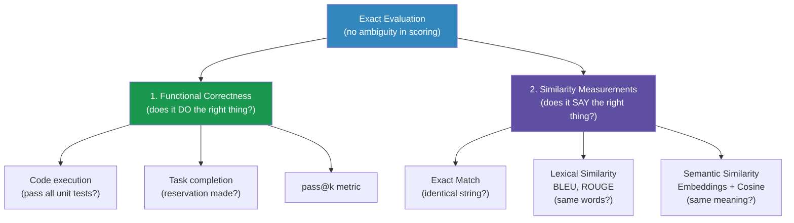

### Functional Correctness: The Gold Standard

The best evaluation asks: **did it work?** Not "does it sound right?" — did it actually work?

For code generation, this means running the code against test cases. The metric is **pass@k**:

> You generate **k** code samples for each problem. A problem is "solved" if any one of those k samples passes all test cases. Final score = fraction of problems solved.

**ISE Analogy:** Think of this like testing an automated inspection algorithm. You don't grade it on how the code *looks*. You run it on 1,000 known defective vs. good parts and count how many it gets right.

### Similarity Measurements: When You Can't Run a Test

| Method | How It Works | When to Use | Key Weakness |
|---|---|---|---|
| **Exact Match** | String equality | Simple Q&A, math, trivia | Fails for open-ended tasks |
| **Lexical (BLEU/ROUGE)** | Shared n-grams | Translation, summarization | Penalizes valid paraphrases |
| **Semantic (Embeddings)** | Cosine distance of vectors | Complex tasks, Q&A | Depends on embedding quality |

### The Embedding Intuition

An embedding transforms text into a point in a high-dimensional space. Similar texts → nearby points. The dot product between two normalized embedding vectors gives **cosine similarity** ∈ [-1, 1].

```
"Equipment failure detected"  → [0.21, 0.83, -0.12, ...]
"Machine breakdown occurred"  → [0.19, 0.81, -0.14, ...]  ← SIMILAR (high cosine)
"The cake is delicious"       → [-0.45, 0.02, 0.77, ...]  ← DIFFERENT (low cosine)
```

---

### 🧪 DEMO 2: Evaluation Methods Comparison
**Open in Google Colab:** Compare exact match, ROUGE, and semantic similarity side by side

```python
# ============================================================
# DEMO 2: Evaluation Methods Comparison
# Week 4 — AI-Enabled Informatics for Engineers (Rutgers ISE)
#
# Compare how exact match, ROUGE, and semantic similarity
# score the SAME set of responses — and where they disagree.
# ============================================================

# !pip install rouge-score sentence-transformers --quiet

import numpy as np
import matplotlib.pyplot as plt
import matplotlib.gridspec as gridspec
from rouge_score import rouge_scorer
from sentence_transformers import SentenceTransformer, util

print("Loading sentence transformer model...")
embed_model = SentenceTransformer('all-MiniLM-L6-v2')  # Fast, small, good quality
print("✅ Model loaded!")

# ─── Dataset: ISE-Relevant Q&A Examples ─────────────────────────────────────────
# Format: (question, reference_answer, [list_of_candidate_answers])
examples = [
    {
        "id": "Q1",
        "question": "What is the primary purpose of predictive maintenance in manufacturing?",
        "reference": "Predictive maintenance uses sensor data and analytics to anticipate equipment failures before they occur, reducing unplanned downtime and maintenance costs.",
        "candidates": {
            "Paraphrase (good)": "The goal of predictive maintenance is to forecast machinery failures using sensor readings and data analytics, thereby minimizing unexpected downtime and cutting maintenance expenses.",
            "Different words, same idea": "By analyzing operational data from equipment, organizations can foresee breakdowns in advance, avoiding costly production halts and emergency repairs.",
            "Partially correct": "Predictive maintenance helps schedule maintenance activities for machines in a factory.",
            "Off-topic": "Manufacturing quality control involves inspecting finished products to ensure they meet specifications.",
            "Completely wrong": "Predictive maintenance is a software testing methodology used to prevent bugs in production code.",
        }
    },
    {
        "id": "Q2",
        "question": "Define throughput in the context of a production system.",
        "reference": "Throughput is the rate at which a production system produces output, typically measured as units per unit time such as parts per hour.",
        "candidates": {
            "Exact-ish match": "Throughput refers to the rate of output production in a system, measured in units per unit time like parts per hour.",
            "Good paraphrase": "In production systems, throughput measures how many finished goods a system can complete within a given time period.",
            "Technically correct but vague": "Throughput is how fast a factory makes things.",
            "Partially wrong": "Throughput is the total amount of inventory stored in a warehouse.",
            "Completely wrong": "Throughput is a networking term describing data transfer speed between computers.",
        }
    }
]

# ─── Scoring Functions ───────────────────────────────────────────────────────────
def exact_match(candidate: str, reference: str) -> float:
    """Binary: 1.0 if strings match (case-insensitive, stripped), else 0.0"""
    return 1.0 if candidate.strip().lower() == reference.strip().lower() else 0.0

def contains_match(candidate: str, reference: str) -> float:
    """1.0 if reference is a substring of candidate"""
    return 1.0 if reference.strip().lower() in candidate.strip().lower() else 0.0

rouge = rouge_scorer.RougeScorer(['rouge1', 'rouge2', 'rougeL'], use_stemmer=True)

def rouge_score(candidate: str, reference: str) -> dict:
    scores = rouge.score(reference, candidate)
    return {
        'R1-F': round(scores['rouge1'].fmeasure, 3),
        'R2-F': round(scores['rouge2'].fmeasure, 3),
        'RL-F': round(scores['rougeL'].fmeasure, 3),
    }

def semantic_similarity(candidate: str, reference: str) -> float:
    emb_ref = embed_model.encode(reference, convert_to_tensor=True)
    emb_cand = embed_model.encode(candidate, convert_to_tensor=True)
    cos_sim = util.cos_sim(emb_ref, emb_cand).item()
    return round(cos_sim, 3)

# ─── Run All Evaluations ─────────────────────────────────────────────────────────
print("\n" + "="*70)
print("Running all evaluation methods on ISE domain Q&A pairs...")
print("="*70)

all_results = []

for ex in examples:
    q = ex["question"]
    ref = ex["reference"]
    print(f"\n📌 {ex['id']}: {q}")
    print(f"   Reference: {ref[:80]}...")
    print(f"\n   {'Candidate':<35} {'ExactM':>7} {'ROUGE-1':>7} {'ROUGE-L':>7} {'Semantic':>9}")
    print("   " + "-"*65)

    for cand_label, cand_text in ex["candidates"].items():
        em = exact_match(cand_text, ref)
        rs = rouge_score(cand_text, ref)
        ss = semantic_similarity(cand_text, ref)
        print(f"   {cand_label:<35} {em:>7.2f} {rs['R1-F']:>7.3f} {rs['RL-F']:>7.3f} {ss:>9.3f}")
        all_results.append({
            "example": ex["id"],
            "candidate": cand_label,
            "exact": em,
            "rouge1": rs['R1-F'],
            "rougeL": rs['RL-F'],
            "semantic": ss,
        })

# ─── Visualization: Method Disagreement ─────────────────────────────────────────
fig = plt.figure(figsize=(18, 10))
fig.suptitle("Evaluation Method Comparison: Where Do They Agree and Disagree?\n"
             "ISE Domain Q&A (Maintenance & Production Systems)",
             fontsize=13, fontweight='bold')

gs = gridspec.GridSpec(2, 3, figure=fig, hspace=0.45, wspace=0.35)

method_colors = {
    'exact': '#d73027',
    'rouge1': '#fc8d59',
    'rougeL': '#fee090',
    'semantic': '#1a9850',
}
method_labels = {
    'exact': 'Exact Match',
    'rouge1': 'ROUGE-1',
    'rougeL': 'ROUGE-L',
    'semantic': 'Semantic Sim.',
}

for i, ex in enumerate(examples):
    ex_results = [r for r in all_results if r["example"] == ex["id"]]
    cand_names = [r["candidate"] for r in ex_results]
    short_names = [c.split("(")[0].strip()[:18] for c in cand_names]

    ax = fig.add_subplot(gs[i, :2])

    x = np.arange(len(cand_names))
    width = 0.2
    offsets = [-1.5, -0.5, 0.5, 1.5]
    for j, (method, offset) in enumerate(zip(['exact', 'rouge1', 'rougeL', 'semantic'], offsets)):
        vals = [r[method] for r in ex_results]
        ax.bar(x + offset * width, vals, width,
               label=method_labels[method],
               color=method_colors[method],
               edgecolor='black', linewidth=0.4)

    ax.set_xticks(x)
    ax.set_xticklabels(short_names, rotation=20, ha='right', fontsize=8)
    ax.set_ylabel("Score (0–1)", fontsize=9)
    ax.set_ylim(0, 1.15)
    ax.set_title(f"{ex['id']}: {ex['question'][:60]}...", fontsize=9, fontweight='bold')
    ax.legend(fontsize=8, loc='upper right')
    ax.grid(axis='y', alpha=0.3)
    ax.axhline(0.5, color='gray', linestyle='--', linewidth=0.7, alpha=0.6)
    ax.text(len(cand_names) - 0.5, 0.52, "0.5 threshold", fontsize=7, color='gray')

# --- Scatter: ROUGE-1 vs Semantic (method disagreement space) ---
ax_scatter = fig.add_subplot(gs[:, 2])
colors_by_quality = {
    "Paraphrase (good)": "#1a9850",
    "Exact-ish match": "#1a9850",
    "Different words, same idea": "#91cf60",
    "Good paraphrase": "#91cf60",
    "Partially correct": "#fee090",
    "Technically correct but vague": "#fee090",
    "Off-topic": "#fc8d59",
    "Partially wrong": "#fc8d59",
    "Completely wrong": "#d73027",
}

for r in all_results:
    color = colors_by_quality.get(r["candidate"], "#666666")
    ax_scatter.scatter(r["rouge1"], r["semantic"], s=80, color=color,
                       edgecolor='black', linewidth=0.5, zorder=3)
    ax_scatter.annotate(r["candidate"][:12], (r["rouge1"], r["semantic"]),
                        fontsize=6, ha='center', va='bottom',
                        xytext=(0, 5), textcoords='offset points')

ax_scatter.set_xlabel("ROUGE-1 Score (Lexical)", fontsize=10)
ax_scatter.set_ylabel("Semantic Similarity", fontsize=10)
ax_scatter.set_title("Where Methods Disagree:\nROUGE-1 vs. Semantic\n(Both Q1 + Q2)", fontsize=10)
ax_scatter.set_xlim(-0.05, 1.05)
ax_scatter.set_ylim(-0.05, 1.05)
ax_scatter.axhline(0.5, color='gray', linestyle='--', linewidth=0.7, alpha=0.5)
ax_scatter.axvline(0.5, color='gray', linestyle='--', linewidth=0.7, alpha=0.5)
ax_scatter.grid(alpha=0.3)

# Quadrant labels
ax_scatter.text(0.15, 0.92, "Semantic good\nLexical bad\n(Good paraphrase!)",
                fontsize=7, ha='center', color='#1a9850', fontweight='bold')
ax_scatter.text(0.85, 0.15, "Lexical good\nSemantic bad\n(Wrong meaning!)",
                fontsize=7, ha='center', color='#d73027', fontweight='bold')

plt.savefig("eval_comparison.png", dpi=150, bbox_inches='tight')
plt.show()

print("\n✅ DEMO 2 Complete!")
print("\n💡 Key Takeaway for ISE:")
print("  ROUGE penalizes good paraphrases. Semantic similarity catches them.")
print("  For industrial AI (e.g., maintenance Q&A systems), semantic similarity")
print("  is generally a better evaluation metric than ROUGE.")
print("\n  ⚠️ But semantic similarity still depends on embedding model quality!")
print("     For domain-specific text (like ISE vocabulary), a domain-tuned")
print("     embedding model will outperform a general-purpose one.")
```

---

## Part 5 — AI as a Judge 🤖
**⏱️ ~8 minutes + Demo 3**

### The Concept

When neither functional correctness nor similarity metrics fully capture quality, we turn to **AI as a Judge (LLM-as-a-Judge)**: use a capable AI model to evaluate another AI model's outputs.

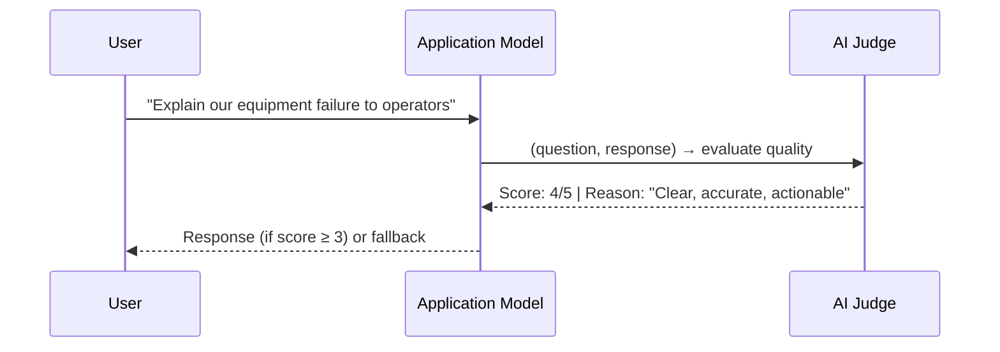

### Three Ways to Use an AI Judge

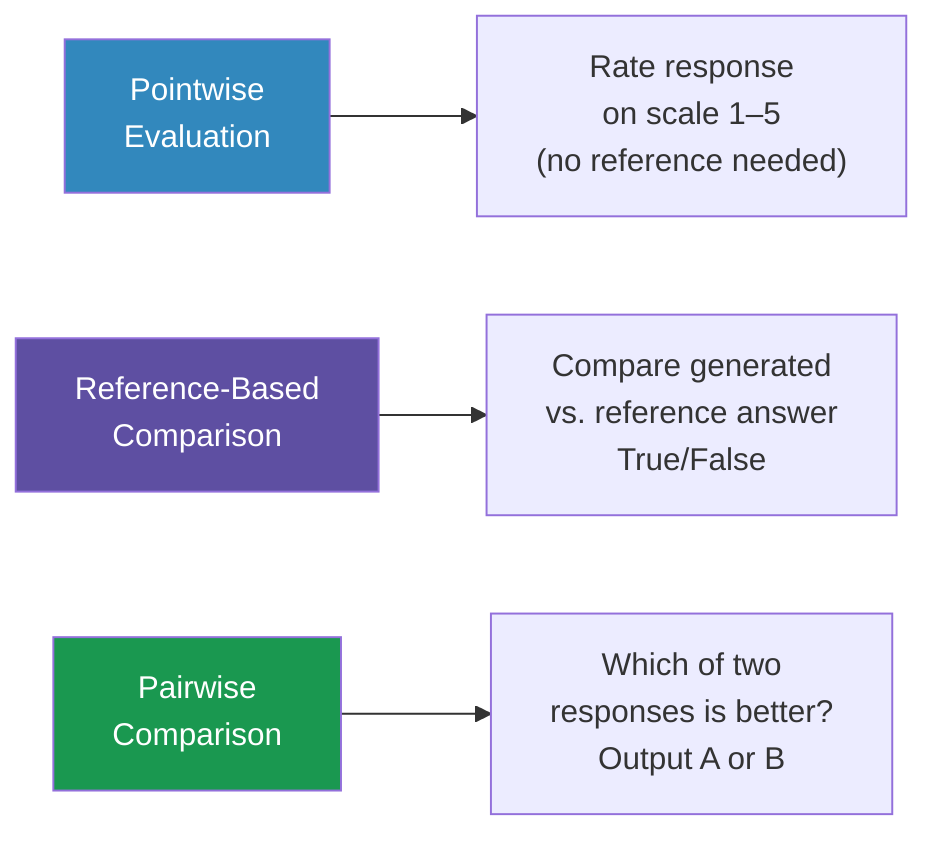

### The Catch: Known Biases in AI Judges

This is critically important. AI judges are NOT neutral:

| Bias | Description | Magnitude | Mitigation |
|---|---|---|---|
| **Self-bias** | Model prefers its own outputs | GPT-4: +10% win rate for self; Claude-v1: +25% | Use a different model as judge |
| **Position bias** | Favors first answer in pairwise | Significant | Randomize answer order; repeat tests |
| **Verbosity bias** | Prefers longer answers, even wrong ones | GPT-4 favors ~100-word wrong over ~50-word right | Explicitly instruct length-neutral scoring |
| **Inconsistency** | Same judge, same input → different scores | 65% base consistency (GPT-4) | Add examples; use low temperature |

> ⚠️ **Rule to live by:** *"Do not trust any AI judge if you can't see the model and the prompt used for the judge."* — Huyen, Ch. 3

### Designing Good Judge Prompts

A high-quality judge prompt has four parts:

1. **Task definition** — What is the judge doing?
2. **Evaluation criteria** — What makes a response good or bad?
3. **Scoring system** — Classification or 1–5 scale (avoid continuous 0–1)
4. **Scored examples** — Show what a 1, 3, and 5 look like

---

### 🧪 DEMO 3: Build and Stress-Test an AI Evaluation Pipeline
**Open in Google Colab:** Build a complete ISE evaluation harness with bias detection

```python
# ============================================================
# DEMO 3: AI Evaluation Pipeline with Bias Detection
# Week 4 — AI-Enabled Informatics for Engineers (Rutgers ISE)
#
# This demo builds a SIMULATED AI judge pipeline that:
# 1. Shows how to structure judge prompts properly
# 2. Demonstrates position bias empirically
# 3. Implements a bias-corrected pairwise comparison
# 4. Connects to NIST AI RMF governance concepts
#
# NOTE: Uses a local scoring simulation so no API key is needed.
# In production, replace `simulated_judge` with an actual LLM API call.
# ============================================================

import numpy as np
import pandas as pd
import matplotlib.pyplot as plt
import matplotlib.gridspec as gridspec
from itertools import combinations
import random

random.seed(42)
np.random.seed(42)

# ─── ISE Domain: Maintenance Q&A Evaluation ──────────────────────────────────────
# We're evaluating AI responses to ISE-domain questions

questions = [
    "What sensor readings most reliably predict bearing failure?",
    "How should operators prioritize work orders when three machines need maintenance?",
    "Explain the difference between MTTR and MTBF to a plant manager.",
    "When should we use FMEA versus fault tree analysis?",
    "Describe the data pipeline needed for a real-time equipment health dashboard.",
]

# Simulated model responses (A=better, B=worse, C=average)
model_responses = {
    "ModelA (Specialized)": {
        q: f"[High-quality domain-specific response addressing {q.split()[0:4]}... "
           f"with specific metrics, tradeoffs, and operational context. Mentions "
           f"relevant standards (ISO 13849, IEC 62443) and provides actionable guidance.]"
        for q in questions
    },
    "ModelB (General)": {
        q: f"[Generic response to {q.split()[0:3]}... Correct but vague, "
           f"lacks domain specificity, no mention of ISE standards or real-world constraints.]"
        for q in questions
    },
    "ModelC (Baseline)": {
        q: f"[Partially relevant response about {q.split()[0:2]}... "
           f"Some factual errors, missing key concepts, but coherent structure.]"
        for q in questions
    },
}

# ─── Part A: Structured Judge Prompt Design ─────────────────────────────────────
print("=" * 70)
print("PART A: Proper AI Judge Prompt Structure for ISE Applications")
print("=" * 70)

JUDGE_PROMPT_TEMPLATE = """
You are an expert Industrial & Systems Engineering evaluation assistant.

TASK:
Evaluate the following AI-generated response to an ISE domain question.
Rate the response on a scale of 1 to 5.

EVALUATION CRITERIA:
- Technical Accuracy: Are facts and concepts correct? (weight: 35%)
- Domain Specificity: Does it use ISE-relevant terminology and context? (weight: 25%)  
- Actionability: Can a practitioner act on this information? (weight: 25%)
- Clarity: Is it understandable to the target audience? (weight: 15%)

SCORING SCALE:
5 = Excellent: Accurate, domain-specific, immediately actionable, very clear
4 = Good: Mostly accurate, good domain context, actionable, clear
3 = Acceptable: Correct but generic, partially actionable, somewhat clear
2 = Poor: Some errors or very vague, limited ISE context, hard to act on
1 = Unacceptable: Inaccurate, irrelevant, or useless

EXAMPLES:
Score 5: "Vibration analysis using FFT on bearing frequencies (BPFO, BPFI, BSF) 
          combined with ISO 10816 severity zones provides reliable bearing failure 
          prediction typically 2-8 weeks in advance..."
Score 3: "You can use vibration sensors to detect bearing problems."
Score 1: "Bearings are important in manufacturing."

QUESTION: {question}
RESPONSE: {response}

Output ONLY a JSON object: {{"score": <1-5>, "reason": "<one sentence>"}}
"""

# Show the template
print("\nJudge Prompt Template:")
print("-" * 60)
# Print abbreviated version
print(JUDGE_PROMPT_TEMPLATE[:600] + "...\n")

# ─── Part B: Simulate Pointwise Evaluation ──────────────────────────────────────
print("\n" + "=" * 70)
print("PART B: Pointwise Evaluation Simulation")
print("=" * 70)

def simulated_judge_pointwise(model_name, question, response, noise_std=0.8):
    """
    Simulates an AI judge's pointwise score.
    In production: replace this with an actual LLM API call using JUDGE_PROMPT_TEMPLATE.
    """
    # Base quality by model (ground truth for simulation)
    base_scores = {"ModelA (Specialized)": 4.5, "ModelB (General)": 2.8, "ModelC (Baseline)": 3.2}
    base = base_scores[model_name]
    # Add realistic noise (judges are inconsistent!)
    score = np.clip(base + np.random.normal(0, noise_std), 1, 5)
    return round(score, 1)

print("\nRunning pointwise evaluation across all models and questions...\n")
pointwise_results = []

for model in model_responses:
    for q in questions:
        resp = model_responses[model][q]
        # Run judge 3 times to show inconsistency
        scores = [simulated_judge_pointwise(model, q, resp) for _ in range(3)]
        pointwise_results.append({
            "model": model,
            "question": q[:40] + "...",
            "run1": scores[0], "run2": scores[1], "run3": scores[2],
            "mean": round(np.mean(scores), 2),
            "std": round(np.std(scores), 2),
        })
        print(f"  {model:<25} | Q: {q[:35]:<35} | Scores: {scores} | μ={np.mean(scores):.1f} σ={np.std(scores):.2f}")

df = pd.DataFrame(pointwise_results)

# ─── Part C: Demonstrate Position Bias ──────────────────────────────────────────
print("\n" + "=" * 70)
print("PART C: Position Bias Demonstration in Pairwise Evaluation")
print("=" * 70)

def simulated_judge_pairwise(model_a, model_b, question, position_bias=0.15):
    """
    Simulate pairwise comparison with position bias.
    position_bias: probability boost for the FIRST model shown.
    """
    base_a = {"ModelA (Specialized)": 0.70, "ModelB (General)": 0.35, "ModelC (Baseline)": 0.50}
    base_b = {"ModelA (Specialized)": 0.70, "ModelB (General)": 0.35, "ModelC (Baseline)": 0.50}

    # True probability A wins + position bias favoring A (shown first)
    true_prob_a_wins = base_a[model_a] / (base_a[model_a] + base_b[model_b])
    biased_prob_a_wins = np.clip(true_prob_a_wins + position_bias, 0, 1)

    return "A" if random.random() < biased_prob_a_wins else "B"

# Compare ModelA vs ModelB with and without position bias correction
N_TRIALS = 200
model_a, model_b = "ModelA (Specialized)", "ModelB (General)"

biased_wins = 0
unbiased_wins = 0

for _ in range(N_TRIALS):
    q = random.choice(questions)
    # Biased: always show model_a first
    result_biased = simulated_judge_pairwise(model_a, model_b, q, position_bias=0.15)
    if result_biased == "A":
        biased_wins += 1

    # Unbiased: randomize order, correct for position
    if random.random() > 0.5:
        result_unbiased = simulated_judge_pairwise(model_a, model_b, q, position_bias=0.0)
    else:
        # Reverse order — position bias now hurts ModelA
        result_unbiased_rev = simulated_judge_pairwise(model_b, model_a, q, position_bias=0.0)
        result_unbiased = "A" if result_unbiased_rev == "B" else "B"

    if result_unbiased == "A":
        unbiased_wins += 1

print(f"\nModelA vs ModelB over {N_TRIALS} trials:")
print(f"  Biased (always first) win rate for ModelA:    {biased_wins/N_TRIALS*100:.1f}%")
print(f"  Unbiased (random order) win rate for ModelA:  {unbiased_wins/N_TRIALS*100:.1f}%")
print(f"  Position bias artifact: +{(biased_wins - unbiased_wins)/N_TRIALS*100:.1f} percentage points")

# ─── Part D: Visualization ───────────────────────────────────────────────────────
fig = plt.figure(figsize=(18, 12))
fig.suptitle("AI Evaluation Pipeline Analysis\n"
             "ISE Domain — Equipment Maintenance Q&A\n"
             "(Demonstrating Evaluation Challenges & Bias Detection)",
             fontsize=13, fontweight='bold')

gs = gridspec.GridSpec(2, 3, figure=fig, hspace=0.5, wspace=0.4)

model_colors = {
    "ModelA (Specialized)": "#1a9850",
    "ModelB (General)": "#d73027",
    "ModelC (Baseline)": "#3288bd",
}

# Plot 1: Mean scores by model
ax1 = fig.add_subplot(gs[0, 0])
model_means = df.groupby("model")["mean"].mean()
model_stds = df.groupby("model")["mean"].std()
models_sorted = ["ModelA (Specialized)", "ModelC (Baseline)", "ModelB (General)"]
means_sorted = [model_means[m] for m in models_sorted]
stds_sorted = [model_stds[m] for m in models_sorted]
cols_sorted = [model_colors[m] for m in models_sorted]
bars = ax1.bar(range(3), means_sorted, color=cols_sorted, edgecolor='black', linewidth=0.5)
ax1.errorbar(range(3), means_sorted, yerr=stds_sorted, fmt='none',
             color='black', capsize=5, linewidth=2)
ax1.set_xticks(range(3))
ax1.set_xticklabels([m.split()[0] for m in models_sorted], fontsize=9)
ax1.set_ylabel("Mean Judge Score (1–5)", fontsize=9)
ax1.set_title("Pointwise Scores\nby Model", fontsize=10, fontweight='bold')
ax1.set_ylim(0, 5.5)
ax1.grid(axis='y', alpha=0.3)
for bar, val in zip(bars, means_sorted):
    ax1.text(bar.get_x() + bar.get_width()/2, bar.get_height() + 0.1,
             f'{val:.2f}', ha='center', fontsize=10, fontweight='bold')

# Plot 2: Score inconsistency (judges are not reliable!)
ax2 = fig.add_subplot(gs[0, 1])
for model in model_responses:
    model_df = df[df["model"] == model]
    run_scores = model_df[["run1", "run2", "run3"]].values.flatten()
    jitter = np.random.normal(0, 0.08, len(run_scores))
    ax2.scatter([model.split()[0][0]+str(i) for i in range(len(run_scores))],
                run_scores + jitter,
                color=model_colors[model], alpha=0.6, s=40, label=model.split()[0])

# Redo as strip chart
ax2.clear()
for idx, model in enumerate(["ModelA (Specialized)", "ModelB (General)", "ModelC (Baseline)"]):
    model_df = df[df["model"] == model]
    all_scores = []
    for col in ["run1", "run2", "run3"]:
        all_scores.extend(model_df[col].values)
    jitter = np.random.normal(0, 0.08, len(all_scores))
    ax2.scatter([idx + j for j in jitter], all_scores,
                color=model_colors[model], alpha=0.6, s=30)
    ax2.hlines(np.mean(all_scores), idx - 0.3, idx + 0.3,
               color=model_colors[model], linewidth=2.5, zorder=5)

ax2.set_xticks(range(3))
ax2.set_xticklabels(["ModelA\n(Spec.)", "ModelB\n(Gen.)", "ModelC\n(Base)"], fontsize=9)
ax2.set_ylabel("Individual Run Score", fontsize=9)
ax2.set_title("Judge Inconsistency:\nSame Input → Different Scores\n(Horizontal line = mean)", fontsize=9, fontweight='bold')
ax2.set_ylim(0, 5.5)
ax2.grid(axis='y', alpha=0.3)

# Plot 3: Position Bias
ax3 = fig.add_subplot(gs[0, 2])
bias_data = {"Biased\n(Always First)": biased_wins/N_TRIALS,
             "Corrected\n(Randomized)": unbiased_wins/N_TRIALS}
bars3 = ax3.bar(range(2), [v*100 for v in bias_data.values()],
                color=["#d73027", "#1a9850"], edgecolor='black')
ax3.set_xticks(range(2))
ax3.set_xticklabels(list(bias_data.keys()), fontsize=9)
ax3.set_ylabel("ModelA Win Rate (%)", fontsize=9)
ax3.set_title(f"Position Bias Effect\nModelA vs ModelB\n({N_TRIALS} trials each)", fontsize=9, fontweight='bold')
ax3.set_ylim(0, 100)
ax3.axhline(50, color='gray', linestyle='--', linewidth=0.8)
ax3.text(0.5, 52, "50% (random chance)", ha='center', fontsize=7, color='gray')
ax3.grid(axis='y', alpha=0.3)
for bar, (key, val) in zip(bars3, bias_data.items()):
    ax3.text(bar.get_x() + bar.get_width()/2, bar.get_height() + 1,
             f'{val*100:.1f}%', ha='center', fontsize=11, fontweight='bold')

# Plot 4: NIST AI RMF Mapping
ax4 = fig.add_subplot(gs[1, :])
ax4.axis('off')

nist_data = {
    "NIST AI RMF\nFunction": ["GOVERN", "MAP", "MEASURE", "MANAGE"],
    "Core Purpose": [
        "Establish accountability,\npolicies & oversight",
        "Identify risks in context\nof use",
        "Analyze & assess\nAI risks",
        "Prioritize & treat\nidentified risks"
    ],
    "Week 4 Evaluation Tool": [
        "Define who owns eval quality;\nset eval standards policy",
        "Identify what can go wrong:\nhallucination, bias, domain drift",
        "Use: perplexity, ROUGE,\nsemantic sim., AI judges",
        "Act on eval results:\nretrain, switch models, add guards"
    ],
    "ISE Application": [
        "Quality Management System\nmaps to eval governance",
        "FMEA: enumerate failure\nmodes of the AI component",
        "OEE / SPC-style monitoring\nof model performance",
        "Corrective action process\nfor AI underperformance"
    ]
}

table_data = []
for i in range(4):
    table_data.append([
        nist_data["NIST AI RMF\nFunction"][i],
        nist_data["Core Purpose"][i],
        nist_data["Week 4 Evaluation Tool"][i],
        nist_data["ISE Application"][i],
    ])

col_labels = ["NIST AI RMF\nFunction", "Core Purpose",
              "Week 4 Evaluation Tool", "ISE Analogy"]
col_colors = [["#5e4fa2", "#3288bd", "#1a9850", "#fc8d59"]] * 4
header_colors = ["#5e4fa2", "#3288bd", "#1a9850", "#fc8d59"]

tbl = ax4.table(
    cellText=table_data,
    colLabels=col_labels,
    loc='center',
    cellLoc='center',
)
tbl.auto_set_font_size(False)
tbl.set_fontsize(8.5)
tbl.scale(1, 3.2)

# Style header
for j, color in enumerate(header_colors):
    tbl[0, j].set_facecolor(color)
    tbl[0, j].set_text_props(color='white', fontweight='bold', fontsize=9)

# Style data rows
row_bg = ["#f0f0f0", "#ffffff", "#f0f0f0", "#ffffff"]
for i in range(1, 5):
    for j in range(4):
        tbl[i, j].set_facecolor(row_bg[i-1])
        tbl[i, j].set_text_props(fontsize=8)

ax4.set_title("NIST AI RMF ↔ Chapter 3 Evaluation Methods ↔ ISE Engineering Analogy",
              fontsize=11, fontweight='bold', pad=10)

plt.savefig("eval_pipeline_analysis.png", dpi=150, bbox_inches='tight')
plt.show()

print("\n✅ DEMO 3 Complete!")
print("\n🔑 Summary of Lessons from Demo 3:")
print("  1. AI judges are inconsistent — always run multiple times & report variance")
print("  2. Position bias inflates win rates by 5-15 percentage points — always randomize order")
print("  3. NIST AI RMF gives you the GOVERNANCE FRAMEWORK to operationalize these methods")
print("  4. ISE engineers already know this pattern: it's just SPC/FMEA applied to AI")
```

---

## Part 6 — Comparative (Pairwise) Evaluation 🏆
**⏱️ ~5 minutes**

When you need to choose between models — not just score them — **comparative evaluation** tells you which is better.

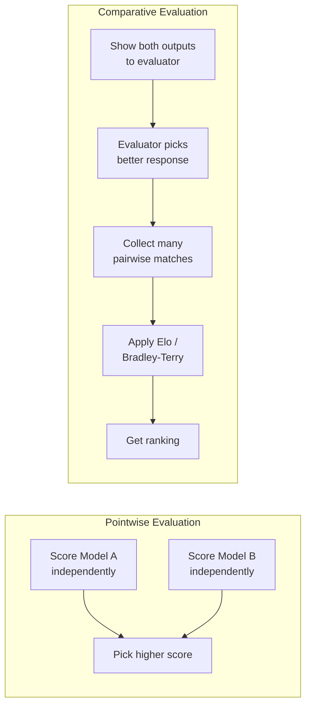

### Why Comparative Evaluation? (The Chess Analogy)

Chess rankings don't score each player independently — they track wins and losses in actual head-to-head matches. The **Elo rating system**, invented in 1960, gives you a score that predicts head-to-head outcome probabilities. **LMSYS Chatbot Arena** uses the same idea for LLMs.

### The Key Limitation: Win Rate ≠ Absolute Quality

> *"If model B wins against A 51% of the time, it's unclear whether both models are good, both are bad, or one is good and one is bad."*

A comparative ranking tells you **ordering**, not **goodness**. You need additional absolute benchmarks to answer "is this good enough for my use case?"

---

## Part 7 — NIST AI Risk Management Framework 🛡️
**⏱️ ~7 minutes**

The NIST AI RMF (NIST AI 100-1, published January 2023) is the **authoritative U.S. government framework** for managing AI risk. As ISE engineers, you'll increasingly encounter compliance requirements based on it.

### The Four Core Functions

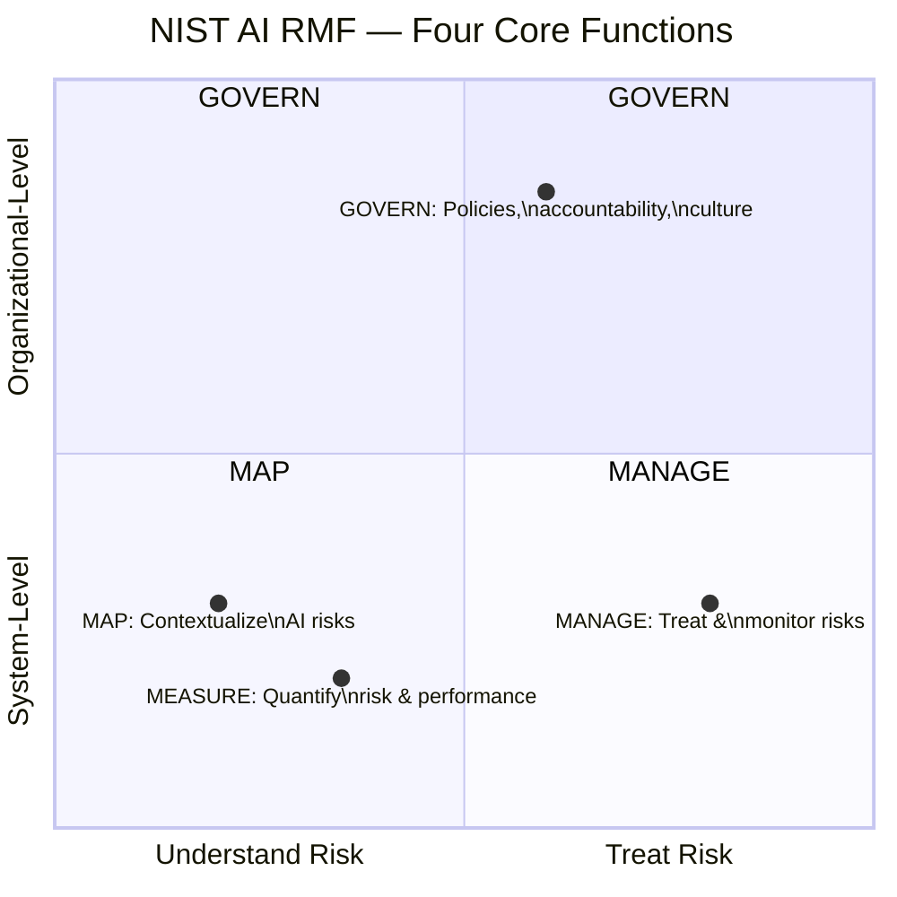

### Connecting Chapter 3 to Each RMF Function

#### 🔵 GOVERN — "Who owns the eval?"
- Assign a **responsible party** for every evaluation pipeline
- Document which models and judge prompts are in use (connects to Huyen's warning: "Don't trust judges you can't inspect")
- Establish update policies: when the judge changes, notify all stakeholders

#### 🟢 MAP — "What can go wrong?"
Before you build evaluation, enumerate failure modes:

| AI Failure Mode | Huyen Ch. 3 Tool | NIST Category |
|---|---|---|
| Hallucination | AI-as-judge faithfulness score | Technical AI Risk |
| Domain drift | Perplexity monitoring | Operational AI Risk |
| Benchmark gaming | Contamination detection via PPL | Trustworthiness |
| Evaluation gaming | Randomized comparative eval | Bias & Fairness |

#### 🟡 MEASURE — "How do we quantify it?"
This is Chapter 3's entire content:
- Perplexity → proxy for model capability
- ROUGE/Semantic similarity → output quality
- Functional correctness → task performance
- AI judges → scalable subjective evaluation
- Comparative eval → relative ranking

#### 🔴 MANAGE — "What do we do about it?"
- Low perplexity on benchmark? → Flag data contamination, retire benchmark
- AI judge shows verbosity bias? → Adjust prompt to normalize length
- Comparative ranking degrades? → Trigger retraining or model swap
- Evaluation gap detected? → Add human-in-the-loop spot checks

### The NIST Trustworthiness Properties (Relevant to Evaluation)

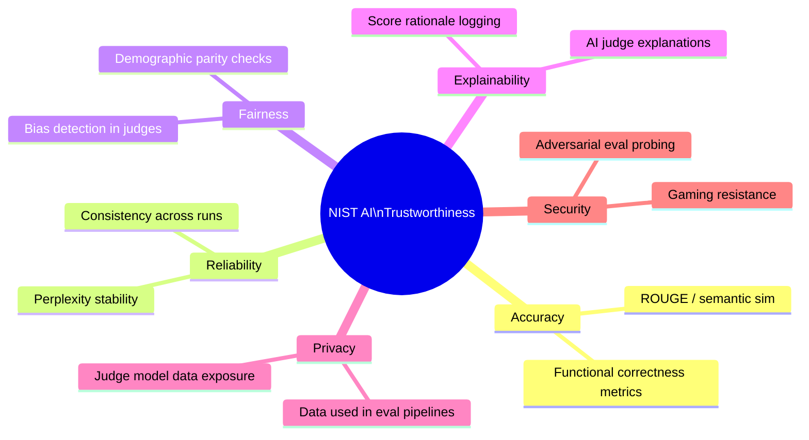

---

## Part 8 — Connecting to Industrial & Systems Engineering ⚙️
**⏱️ ~7 minutes**

Everything in Chapter 3 maps cleanly onto ISE concepts you already know. The translation is the key skill you develop in this course.

### The Evaluation-Quality Management Analogy

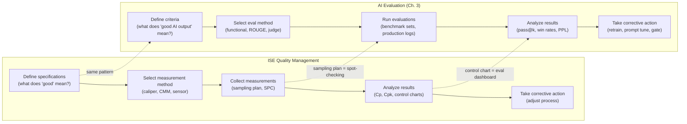

### Concrete ISE Applications in This Course

| ISE Domain | AI Application | Key Ch. 3 Eval Method | Assignment Connection |
|---|---|---|---|
| **Predictive Maintenance** | Failure prediction model | Functional correctness (did it catch real failures?) + cost-weighted metrics | Assignment 2: decision-aligned evaluation memo |
| **Quality Control** | Defect detection vision model | Precision/recall with cost model (false negatives are expensive) | M2 milestone: evaluation plan |
| **Supply Chain** | Demand forecasting | Semantic similarity of narrative summaries + MAPE for numerical outputs | M3 MVP evaluation |
| **Scheduling** | LLM-assisted work order prioritization | AI judge for rationale quality + functional correctness of schedule feasibility | A3 MVP build |
| **Process Monitoring** | Anomaly detection chatbot | Perplexity-based anomaly detection | Week 6 discussion |

### Why Accuracy Is a Weak Metric — The ISE Perspective

Week 4's discussion question: *"Why accuracy is a weak metric in many informatics problems."*

Here's your answer through the lens of ISE:

**Example:** You're building an AI system to flag turbine anomalies. Your dataset has 1000 samples: 980 normal, 20 anomalous.

| Metric | Value | Tells You |
|---|---|---|
| Accuracy | 98% | Nothing — a model that always says "normal" scores 98% |
| Recall (Sensitivity) | 20% | The model catches only 4 of 20 anomalies — terrible! |
| Cost-weighted Score | $50M missed | 16 missed anomalies × $3M avg repair = $48M + $2M downtime |

**The right metric = cost-aligned metric.** Chapter 3's evaluation methodology gives you the tools to build cost-weighted evaluation. This is exactly what Assignment 2 asks you to do.

---

## 🎓 Lecture Summary

```mermaid
flowchart TD
    subgraph "What You Learned Today"
        L1["💥 Evaluation = Critical Engineering\nNot an afterthought"]
        L2["⚠️ Foundation models are hard to eval:\nopen-ended, black-box, saturating benchmarks"]
        L3["📐 Perplexity: model uncertainty metric\nentropy + cross-entropy → perplexity\nUses: capability proxy, contamination, anomalies"]
        L4["🎯 Exact Evaluation:\nFunctional correctness (pass@k)\nLexical sim (ROUGE, BLEU)\nSemantic sim (embeddings + cosine)"]
        L5["🤖 AI as a Judge:\nFast, scalable, flexible\nBut: self-bias, position bias, verbosity bias\nAlways inspect the model AND prompt"]
        L6["🏆 Comparative Evaluation:\nPairwise ranking via Elo/Bradley-Terry\nLimitless (won't saturate)\nBut: no absolute quality signal"]
        L7["🛡️ NIST AI RMF:\nGOVERN → MAP → MEASURE → MANAGE\nEvaluation IS the MEASURE function"]
        L8["⚙️ ISE Connection:\nSame as SPC/FMEA/QMS — applied to AI\nCost-weighted metrics > accuracy"]
    end

    L1 --> L2 --> L3 --> L4 --> L5 --> L6 --> L7 --> L8
```

---

## 📚 This Week's Work

### Assignment 2 (Graded — Due this week)
**Decision-Aligned Evaluation Memo** (1–2 pages)

Using what you learned today, write a memo for your semester project that includes:
1. **Decision** — What decision does your AI system support?
2. **Stakeholder** — Who makes this decision?
3. **Error Types** — What are the false positives and false negatives?
4. **Cost Model** — What does each error type cost? ($ or operational impact)
5. **Metrics** — Which metrics from today's lecture will you use and why?
6. **Evaluation Plan** — How will you collect and score your eval data?

**Required:** Cite at least one of: Huyen Ch. 3 or NIST AI RMF

### Project Milestone M2 (Graded — Due this week)
**Pipeline + Schema + Evaluation Plan**
- One diagram: ingest → transform → store → serve
- Schema with types that support your decision questions
- Evaluation plan (must include at least one metric beyond accuracy)

### Discussion (Canvas, respond to classmates in Thursday TA session)
**"Why accuracy is a weak metric in many informatics problems."**

Use a real example from your project domain to argue your case. Reference cost, stakeholder impact, or NIST AI RMF principles.

---

## 📖 References

| Source | URL |
|---|---|
| Chip Huyen, AI Engineering Ch. 3 | Available via Rutgers Library |
| NIST AI RMF | https://www.nist.gov/itl/ai-risk-management-framework |
| NIST AI 100-1 PDF | https://nvlpubs.nist.gov/nistpubs/ai/nist.ai.100-1.pdf |
| LMSYS Chatbot Arena | https://chat.lmsys.org |
| MTEB (Embedding Benchmark) | https://huggingface.co/spaces/mteb/leaderboard |
| HumanEval Benchmark | https://github.com/openai/human-eval |
| Sentence Transformers | https://sbert.net |
| GPT-2 (Demo 1 & 3) | https://huggingface.co/gpt2 |

---

> **🔗 GitHub Repository:** https://github.com/AI-Enabled-Informatics-for-Engineers/ISE  
> **📧 Questions?** ri128@rutgers.edu | TA sessions: Mon & Thu 12:10–1:30pm  
> **Next Week (Week 5):** Chapter 5 — Prompt Engineering as Interface + Human-Centered Informatics

---
*Lecture prepared for ISE AI-Enabled Informatics, Spring 2026 | Dr. Ron Iammartino, Rutgers University*
